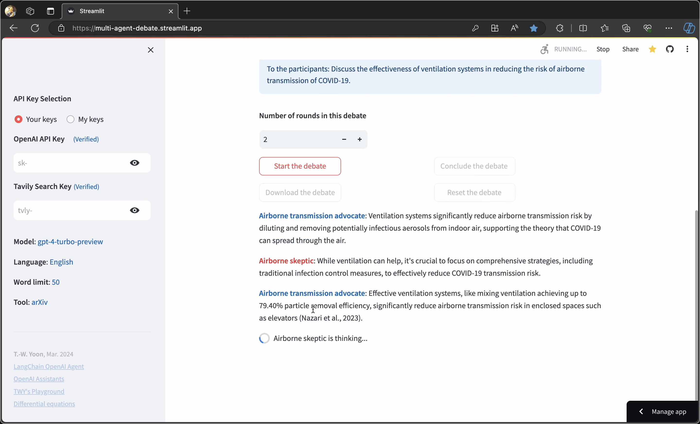

# [Multi_Agent_Debate](https://multi-agent-debate.streamlit.app/)

* This app presents two agents debating on a given topic. After a number of discussion rounds,
  the debate is concluded by a Moderator agent.
  
  - For the LLM model, "gpt-4-turbo-preview" is used, as "gpt-3.5-turbo" does not
    have a sufficient context window. Your OpenAI API key is required to run this code.
    You can obtain an API key from https://platform.openai.com/account/api-keys.

  - Supported tools include Tavily Search, ArXiv, and retrieval (RAG).
    * To use Tavily Search, you need a Tavily API key that can be obtained
      [here](https://app.tavily.com/).

  - Tracing LLM messages is possible using LangSmith if you download the source code
    and run it on your machine or server. For this, you need a
    LangChain API key that can be obtained [here](https://smith.langchain.com/settings).

  - When running the code on your machine or server, you can use st.secrets to keep and
    fetch your API keys as environments variables. For such secrets management, see
    [this page](https://docs.streamlit.io/deploy/streamlit-community-cloud/deploy-your-app/secrets-management).

* The main idea in this code is based on the article
  ['Agent 2 Agent Conversations'](https://cobusgreyling.medium.com/two-llm-based-autonomous-agents-debate-each-other-e13e0a54429b).

## Usage
```python
streamlit run Multi_Agent_Debate.py
```
[](https://youtu.be/f21v0o9aECY)
